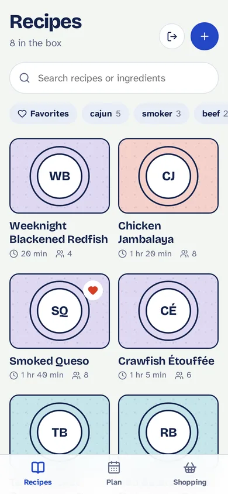
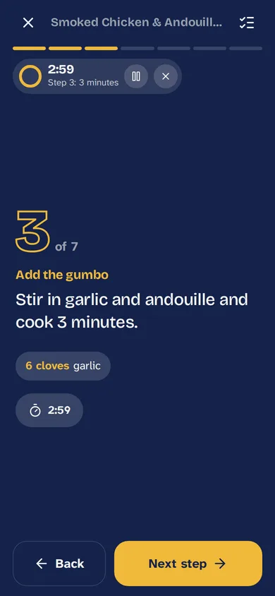
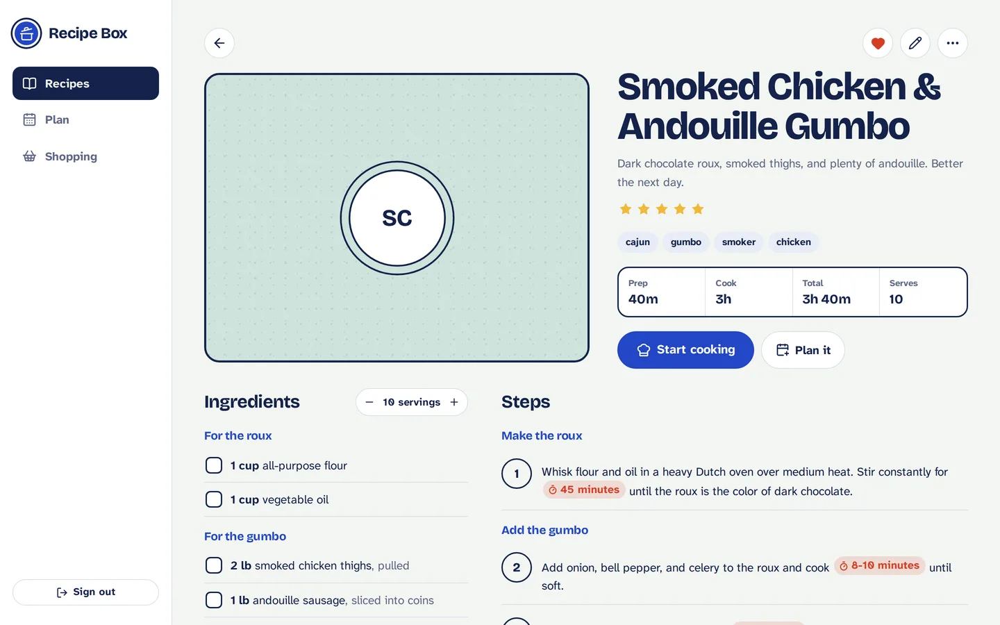

# Recipe Box

A private recipe manager for our household. It runs on Cloudflare's free tier, works on phone, iPad, and laptop (installable as an app), and has a built-in MCP server so an AI assistant can import recipes, plan meals, and build the shopping list.

<p>
  
  
</p>



- **Recipes**: search by title, ingredient, or tag; favorites, ratings, notes, photos, and a cooked history
- **Cooking mode**: full-screen step-by-step view with swipe or arrow-key navigation, the ingredients for each step (scaled), one-tap timers, and the screen kept awake
- **Scaling**: change servings and every amount updates, with kitchen-friendly fractions
- **Meal plan**: weekly planner with recipes or notes ("Leftovers"), per-meal servings
- **Shopping list**: built from the week's plan, merged across recipes and grouped by aisle
- **AI access**: an MCP endpoint only the owner can connect, using OAuth (Claude, Claude Code) or a static key (self-hosted agents)

## How it's built

```
Browser (React PWA) ──► Cloudflare Worker ──► D1 (SQLite): recipes, plan, shopping list
                             │            └─► KV: photos, OAuth grants, rate limits
AI agent ──── /mcp ──────────┘
```

| Piece | What it is |
| --- | --- |
| `src/` | React app (Vite). No UI framework; styles in `src/styles.css`. |
| `worker/` | The Worker: REST API (`api.ts`), MCP server (`mcp.ts`), OAuth consent page (`oauth.ts`), recipe page importer (`importer.ts`), data access (`store.ts`). |
| `shared/` | Ingredient parsing, scaling, timer detection, and shopping-list merging, used by both sides. |
| `migrations/` | D1 schema. Add a new numbered file for schema changes; the deploy applies it. |
| `.github/workflows/` | CI on branches and pull requests; deploy on push to `main`. |

Everything fits in Cloudflare's free plan: Workers (100k requests/day), D1 (5 GB), and KV (1 GB, 1,000 writes/day, which is plenty for photo uploads at household scale). No credit card is needed.

## One-time setup

### 1. Cloudflare

1. Create a free account at [dash.cloudflare.com](https://dash.cloudflare.com).
2. Open **Workers & Pages** once so Cloudflare assigns your `workers.dev` subdomain.
3. Copy your **Account ID** (Workers & Pages overview, right side).
4. Create an API token: **My Profile → API Tokens → Create Token → "Edit Cloudflare Workers" template**, then add one more permission row: **Account → D1 → Edit**. Scope it to your account and create it.

### 2. GitHub repository secrets

In this repo: **Settings → Secrets and variables → Actions → New repository secret**.

| Secret | Value |
| --- | --- |
| `CLOUDFLARE_API_TOKEN` | The token from step 1.4 |
| `CLOUDFLARE_ACCOUNT_ID` | The account ID from step 1.3 |
| `APP_PASSWORD` | The household password you and your wife type to open the site |
| `OWNER_PASSWORD` | A different password, known only to you, required to connect an AI agent |
| `MCP_API_KEY` | Optional. A long random string for agents that can't do OAuth. Generate one with `openssl rand -hex 32`. |

### 3. Deploy

Push to `main`, or run **Actions → Deploy → Run workflow**. The first run creates the D1 database and KV namespaces, uploads the secrets, and applies the schema. The site is then at:

```
https://recipe-manager.<your-subdomain>.workers.dev
```

Every later push to `main` type-checks, tests, migrates, and deploys. Changing a password is done by updating the GitHub secret and re-running the workflow; changing `APP_PASSWORD` signs out every device.

### 4. Install on phone and iPad

Open the site in Safari, tap **Share → Add to Home Screen**. It opens full-screen like an app, and recipes you've viewed stay readable offline.

## Connecting AI

The MCP endpoint is `https://recipe-manager.<your-subdomain>.workers.dev/mcp`.

**Claude (web, desktop, mobile):** Settings → Connectors → **Add custom connector**, paste the URL, then **Connect**. A Recipe Box page asks for the **owner password**; approve and you're connected. Your wife can use the website but can't connect an agent without that password.

**Claude Code:**

```sh
claude mcp add --transport http recipes https://recipe-manager.<your-subdomain>.workers.dev/mcp
```

Then run `/mcp` in Claude Code to sign in.

**Agents without OAuth** (for example a self-hosted agent): send the `MCP_API_KEY` as a header, `Authorization: Bearer <key>`, to the same URL.

### What an agent can do

| Tool | Purpose |
| --- | --- |
| `search_recipes`, `get_recipe`, `list_tags` | Find and read recipes |
| `fetch_recipe_from_url` | Download a recipe page and return its structured recipe data (or page text) |
| `create_recipe`, `update_recipe`, `delete_recipe`, `mark_recipe_cooked` | Manage recipes; `imageUrl` downloads and stores a photo |
| `get_meal_plan`, `add_to_meal_plan`, `update_meal_plan_entry`, `remove_meal_plan_entries` | Plan meals |
| `get_shopping_list`, `generate_shopping_list`, `add_shopping_items`, `update_shopping_item`, `clear_shopping_list` | Shopping list |

Example prompts:

- "Import this recipe into my recipe box: https://…"
- "Here's a photo of my grandmother's recipe card. Add it, tagged cajun and dessert."
- "Plan dinners for next week from my recipes. Nothing over an hour on weeknights, and use the smoker on Saturday. Then build the shopping list."

### Moving recipes over from CookBook

In the CookBook app: **Side menu → Settings → Backup / Export recipes**, choose **Text** format, and save the ZIP. Unzip it, attach the files to a Claude conversation with the connector enabled, and ask it to import them. Photos in CookBook exports link back to CookBook's servers, so do the import before cancelling that subscription.

## Local development

```sh
npm install
cp .dev.vars.example .dev.vars        # local passwords
npm run db:migrate:local
npm run dev                           # http://localhost:5173
```

`npm test` runs the unit tests, `npm run typecheck` checks types, and `npm run build` produces the deployable bundle in `dist/`.

## Security notes

- The site requires the household password; sessions are HMAC-signed, HTTP-only cookies valid for 180 days. Failed logins are limited to 10 per IP per 15 minutes.
- The MCP endpoint only accepts OAuth tokens granted through the consent page (which requires `OWNER_PASSWORD`) or the optional static key. OAuth tokens and grants are stored hashed in KV.
- Photos are served only to signed-in browsers.
